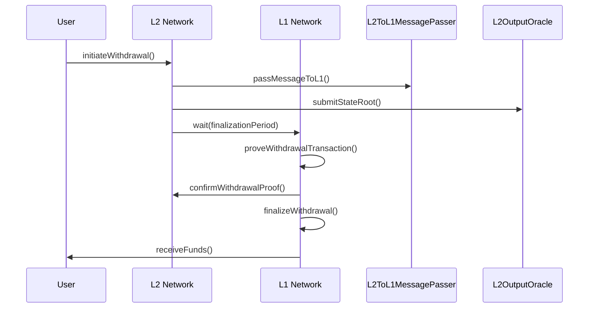
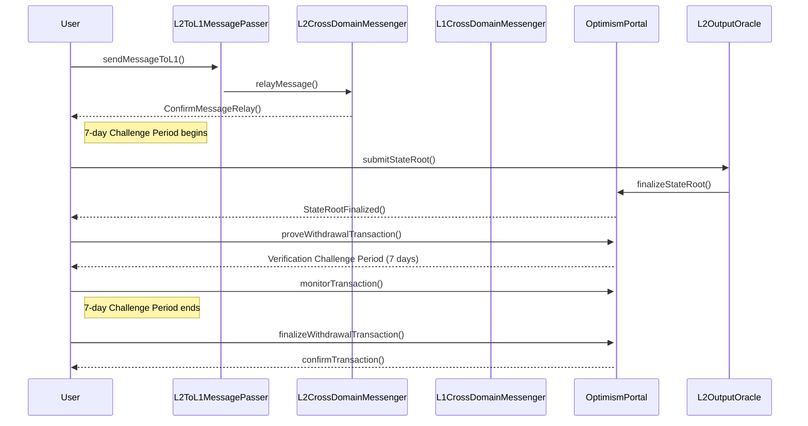

```mermaid
sequenceDiagram
    participant User
    participant L2 as L2 Network
    participant L1 as L1 Network

    User ->> L2: initiateWithdrawal()
    L2 ->> L2ToL1MessagePasser: passMessageToL1()
    L2 ->> L2OutputOracle: submitStateRoot()
    L2 ->> L1: wait(finalizationPeriod)
    L1 ->> L1: proveWithdrawalTransaction()
    L1 ->> L2: confirmWithdrawalProof()
    L1 ->> L1: finalizeWithdrawal()
    L1 ->> User: receiveFunds()
```
    

```mermaid
sequenceDiagram
    participant User
    participant L2ToL1MessagePasser
    participant L2CrossDomainMessenger
    participant L1CrossDomainMessenger
    participant OptimismPortal
    participant L2OutputOracle

    User->>+L2ToL1MessagePasser: sendMessageToL1()
    L2ToL1MessagePasser->>L2CrossDomainMessenger: relayMessage()
    L2CrossDomainMessenger-->>User: ConfirmMessageRelay()
    Note right of User: 7-day Challenge Period begins
    User->>L2OutputOracle: submitStateRoot()
    L2OutputOracle->>OptimismPortal: finalizeStateRoot()
    OptimismPortal-->>User: StateRootFinalized()
    User->>+OptimismPortal: proveWithdrawalTransaction()
    OptimismPortal-->>User: Verification Challenge Period (7 days)
    User->>OptimismPortal: monitorTransaction()
    Note right of User: 7-day Challenge Period ends
    User->>+OptimismPortal: finalizeWithdrawalTransaction()
    OptimismPortal-->>User: confirmTransaction()
```
